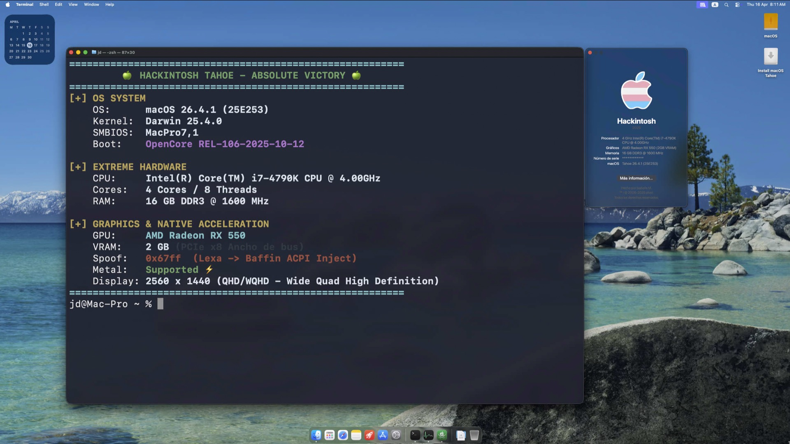

# Hackintosh i7-4790K + RX 550 Lexa — macOS Tahoe (26.x)



> [!CAUTION]
> ## ⛔ No copies esta EFI directamente
>
> Este repositorio es una **contribución técnica a la comunidad hackintosh**, no una EFI lista para usar. El autor lo comparte para documentar la solución porque otras personas en la misma situación (RX 550 Lexa sin Metal) no encontraban información clara — y una EFI pública de otro repo fue el punto de partida que permitió encontrar la respuesta.
>
> **Por qué NO deberías copiar y pegar la EFI tal cual:**
> - El `config.plist` contiene un **número de serie (Serial Number), MLB y SystemUUID** generados específicamente para este hardware. Usarlos en otro equipo puede causar conflictos con los servidores de Apple (iMessage, iCloud, activación).
> - La ruta ACPI del GPU (`\_SB.PCI0.PEG0.PEGP`) y el path PCI son **específicos de esta placa B85**. En otro hardware pueden ser completamente distintos.
> - Los kexts de red están configurados para el controlador Realtek de esta placa. El tuyo puede ser diferente.
>
> **Qué SÍ podés (y deberías) hacer:**
> 1. Estudiar la técnica del `SSDT-GPU-SPOOF.aml` documentada en [`docs/10`](docs/10_Fix_GPU_Lexa_ACPI_SSDT_Spoof.md).
> 2. Verificar la ruta ACPI de tu propia GPU con Hackintool (pestaña PCIe).
> 3. Compilar tu propio SSDT adaptado usando el fuente en `scripts/SSDT-GPU-SPOOF-Haswell.dsl` como base.
> 4. Generar tus propios seriales SMBIOS con [GenSMBIOS](https://github.com/corpnewt/GenSMBIOS).

> [!NOTE]
> ## ✅ FUNCIONANDO — Metal GPU Activo en macOS Tahoe (26.4.1)
>
> Tras **varios días de batalla intensa** probando configuraciones, el sistema **finalmente funciona con aceleración Metal completa** en **macOS Tahoe 26.4.1 (25E253)**!
>
> **La clave que nadie documentaba claramente:** el spoofing de GPU en chips Lexa **no funciona** vía `DeviceProperties` en el `config.plist` de OpenCore. Hay que hacerlo a nivel ACPI mediante un `SSDT-GPU-SPOOF.aml` compilado con la ruta correcta del hardware. Al hacerlo así, macOS reconoce la placa con aceleración 100% como Baffin (`67FF`), habilitando Metal!
>
> Ver documentación completa en [`docs/10_Fix_GPU_Lexa_ACPI_SSDT_Spoof.md`](docs/10_Fix_GPU_Lexa_ACPI_SSDT_Spoof.md)

---

> [!IMPORTANT]
> ## ⚠️ Advertencia: RX 550 Lexa requiere configuración especial
>
> La **AMD RX 550 con chip Lexa (Device ID `1002:699F`)** no tiene soporte nativo en macOS. Funciona mediante un spoof a Baffin (`67FF`), **pero únicamente si la inyección se hace a nivel ACPI** (SSDT), no a nivel OpenCore (DeviceProperties). Ver [`docs/10_Fix_GPU_Lexa_ACPI_SSDT_Spoof.md`](docs/10_Fix_GPU_Lexa_ACPI_SSDT_Spoof.md) para entender por qué y cómo reproducirlo.

---

## El Camino Recorrido

Este proyecto no fue una instalación rápida. Fue una investigación real de incompatibilidades de hardware y sus causas raíz:

| Intento | macOS | Resultado |
|---------|-------|-----------|
| **Tahoe (macOS 26) sin spoof ACPI** | Primera prueba | ❌ Sin aceleración, lag crítico |
| **Sequoia (macOS 15) sin spoof ACPI** | Segunda prueba | ❌ Interfaz sin respuesta (catch-22 sin Metal básico) |
| **Monterey + DeviceProperties spoof** | Tercera prueba | ❌ GPU identificada, acelerador `=0` |
| **Monterey + SSDT ACPI spoof** | Progreso sólido | ✅ Metal activo, demostró que el spoof funcionaba |
| **Tahoe (macOS 26.4.1) + SSDT ACPI spoof** | **Victoria Absoluta** | ✅ Metal activo, sistema perfectamente fluido con RX 550 |

La GPU spoofada pasó de fallar repetidamente a mostrar **Metal: Supported** (con drivers Baffin `AMDRadeonX4000` ejecutándose 100% estable). ¡La persistencia dio sus frutos!

---

## Especificaciones del Hardware

- **Procesador:** Intel Core i7-4790K (Haswell, 4 núcleos / 8 hilos, 4.0GHz base)
- **Placa Base:** Intel B85 Chipset
- **Memoria RAM:** 16 GB
- **Tarjeta Gráfica:** AMD ASRock Phantom Gaming Radeon RX 550 PHANTOM G R RX550 2GB GDDR5
  - Chip interno: **Lexa (Device ID: `1002:699F`)**
  - Spoofado a: **Baffin (`67FF`)** vía SSDT ACPI — ✅ Metal funcionando
- **Almacenamiento macOS:** SSD SATA 256 GB en caja USB 3.0 externa
- **Red:** Realtek PCIe GbE Family Controller
- **Audio:** High Definition Audio (Realtek)
- **macOS instalado:** Tahoe 26.4.1 (Build 25E253)

---

## Configuración EFI Activa

La EFI funcional fue adaptada para Tahoe. Elementos clave:

| Componente | Valor | Propósito |
|-----------|-------|-----------|
| **SMBIOS** | `MacPro7,1` | Compatibilidad y estabilidad |
| **SSDT** | `SSDT-GPU-SPOOF.aml` | Spoof Lexa → Baffin a nivel ACPI |
| **boot-args** | `-radcodec agdpmod=pikera` | Decodificación HW y salida display AMD |
| **iGPU** | HD 4600 headless (`04001204`) | Asistencia decodificación |
| **Red** | RealtekRTL8111.kext | Ethernet funcionando |
| **Audio** | AppleALC alcid=1 | Audio funcionando |

---

## Para Reproducir Este Hackintosh

1. Instalar macOS usando el USB con una EFI funcional. Gracias al Spoof ACPI, la aceleración es **totalmente nativa (no se requiere OCLP)**.
2. En OpenCore picker: **Reset NVRAM** antes del primer arranque tras cambios
3. Verificar que Metal está activo:
   ```bash
   system_profiler SPDisplaysDataType | grep -i metal
   # → Metal: Supported
   
   ioreg -l | grep "AMDBaffinGraphicsAccelerator" | grep -v "=0"
   # → registered, matched, active
   ```
4. Si el acelerador no carga: asegurarse de que `SSDT-GPU-SPOOF.aml` está en `EFI/OC/ACPI/` **y** declarado en `config.plist → ACPI → Add`

---

## ¿Tenés una RX 550 Lexa y encontraste otra solución?

Este repositorio es **público**. Si lograste hacer funcionar Metal con otro método o en otra versión de macOS, abrí un **[Issue](../../issues)** describiendo:
- Versión de macOS
- Configuración de tu EFI (especialmente ACPI y DeviceProperties)
- Output de `ioreg -l | grep -i accelerator`

---

## Estructura de Documentación (`/docs`)

| Nº | Documento | Contenido |
|----|-----------|-----------|
| 01-05 | Configuración base | Extracción de hardware, preparación EFI inicial |
| 06 | Preparación USB y Flasheo | Proceso de creación del instalador USB |
| 07 | Análisis EFIs | Comparativa EFI personalizada vs. Olarila |
| 08 | Troubleshooting Tahoe | Por qué Tahoe fue descartado |
| 09 | Veredicto GPU y Downgrade a Monterey | La investigación comunitaria y la decisión técnica |
| **10** | **Fix GPU Lexa — SSDT ACPI Spoof** | **La solución definitiva documentada paso a paso** |
