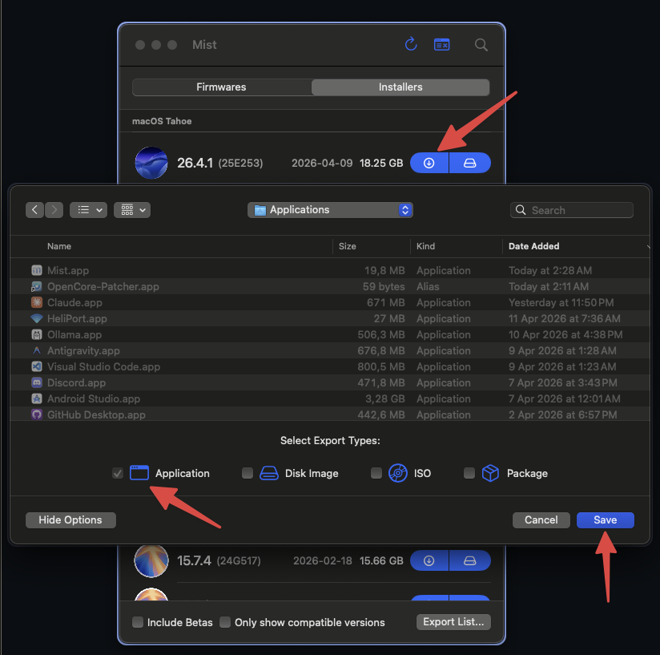
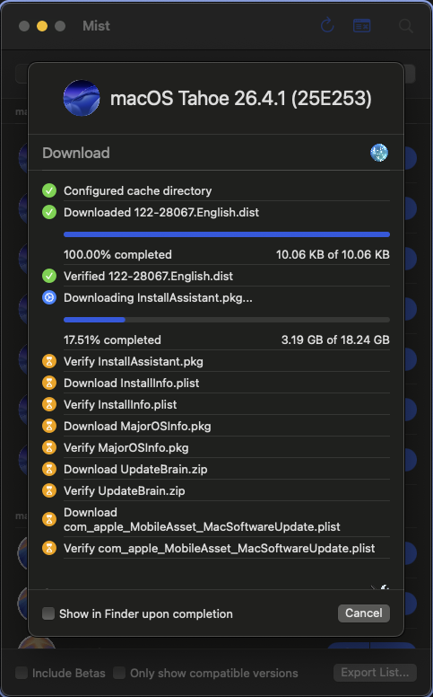

# Fase 5: Descarga Oficial del Sistema Operativo con MIST

Para asegurar una instalación fluida, segura y libre de modificaciones malintencionadas (como ocurre a menudo con distribuciones estilo Olarila), **debemos descargar el instalador original y genuino de macOS**. 

La magia de este proyecto es que **hemos optado por la "Ruta VIP"**. Dado que contamos afortunadamente con una computadora Apple adicional (una MacBook Pro antigua), podemos generar el USB instalador ("Full Offline Installer") oficial, evitando por completo el sufrimiento de construir este disco nativo desde Windows, lo cual habría sido el equivalente a armar un rompecabezas a ciegas.

## La Herramienta: MIST
Para esto, se utiliza el excelente proyecto de código abierto **MIST (Mac Installer Software Tool)**, creado por @ninxsoft. Puedes visitar su repositorio oficial aquí: [https://github.com/ninxsoft/Mist](https://github.com/ninxsoft/Mist). 

### ¿Por qué MIST?
Nuestra MacBook Pro donante era de 2015, por lo tanto, la "Mac App Store" oficial de Apple bloquea agresivamente las descargas de macOS nuevos (como Tahoe o Sequoia) alegando "Incompatibilidad de Hardware". 

MIST soluciona esto interactuando directamente con los servidores centrales de distribución de Apple (`swcdn.apple.com`). Pide el paquete de 14GB ignorando las restricciones por edad de la máquina, y luego ensambla internamente la app "Instalar macOS.app", dejándola lista de fábrica en la carpeta de Aplicaciones.

### Proceso de Descarga Documentado

1. En la pestaña de Instaladores, ubicamos la última versión oficial de **macOS Tahoe** (versión 26.x).
2. Se hizo clic en el botón con la flecha azul (Download) y se eligió el formato de exportación **"Application"** ("Instalar macOS Tahoe.app"), para que posteriormente la propia terminal de Apple pudiese flashear el USB a través del comando `createinstallmedia`.

3. Posteriormente, el sistema inició la extracción paralela a máxima velocidad directamente desde los repositorios genuinos de Apple.

Una vez finalizado, el archivo se transfiere a un USB nativamente en Mac OS Plus y se le inyecta nuestra estructura personalizada de la carpeta `EFI/` detallada en los otros documentos.
