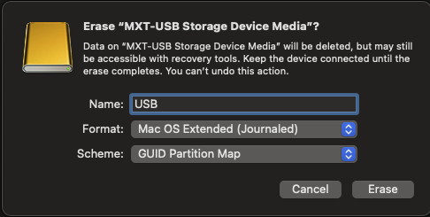

# Fase 6: Preparación del Pendrive USB y Flasheo de macOS

Una vez que el instalador de macOS oficial (`InstallAssistant.pkg` / `.app`) fue descargado mediante herramientas como MIST, el siguiente paso crítico es trasladarlo a una memoria USB (Pendrive) que actuará como nuestro instalador "Offline".

Esta etapa suele ser un punto común de errores si no se aplican los formatos correctos.

## 1. Regla de Oro del Formateo: ¿APFS o Mac OS Extended?
Es un error muy frecuente pensar que el pendrive USB debe formatearse en **APFS** (el sistema de archivos moderno de Apple). Si bien es cierto que macOS requiere APFS para funcionar de forma nativa en el disco final, el **Pendrive de Instalación** tiene reglas diferentes estipuladas por Apple (Artículo de Soporte HT201372):

> **¡Atención!** El pendrive USB debe formatearse EXCLUSIVAMENTE en **Mac OS Extended (Journaled)** (también traducido como *Mac OS Plus (con registro)*).

### ¿Por qué esta restricción?
El comando oficial de Apple (`createinstallmedia`) está programado a bajo nivel para reestructurar volúmenes tradicionales HFS+ (Mac OS Extended) para montar allí la imagen temporal de recuperación. Si se asigna APFS al USB inicial, el script de la Terminal fallará, reportando incapacidad de desmontar y escribir en el volumen. APFS se usará más adelante **solamente** a la hora de borrar el disco de destino final (el SSD) en la pantalla de la instalación gráfica.

### Instrucciones de Formateo de Utilidad de Discos:
1. Conectar un USB de al menos **16GB** (Recomendado 64GB).
2. Abrir **Utilidad de Discos** en la Mac.
3. Seleccionar la **RAÍZ** del dispositivo físicamente conectada (Ej: MXT-USB Storage Device Media).
4. Hacer clic en **Borrar** (Erase) y aplicar la siguiente configuración obligatoria:
   - **Nombre:** `USB`
   - **Formato:** `Mac OS Extended (Journaled)`
   - **Esquema:** `Mapa de particiones GUID` (GUID Partition Map).  *<- ¡Crítico! Esto genera la partición oculta "EFI" donde introduciremos OpenCore.*



## 2. Flasheo Oficial por Terminal
Con el disco formateado a "USB", se abre la aplicación **Terminal** en la Mac y se ejecuta el constructor oficial:

```bash
sudo "/Applications/Install macOS Tahoe 26.4.1_25E253.app/Contents/Resources/createinstallmedia" --volume /Volumes/USB
```
*(Nota: "Install macOS Tahoe..." es meramente un ejemplo del nombre de la App bajada de MIST, el nombre puede variar según la versión).*
Se solicita la contraseña del usuario (la cual no mostrará asteriscos por seguridad) y se debe confirmar con la tecla `Y`. El proceso tardará dependiendo de las velocidades de escritura del puerto y la llave.

## 3. Inyección de la Carpeta EFI (El "Cerebro" del Hackintosh)
Un instalador base de Apple jamas booteará en hardware ensamblado por piezas (Intel/AMD). La magia de hacer funcionar el sistema la provee la partición secundaria:

1. Terminado el flasheo, se debe destapar la partición especial de arranque.
2. Usando la terminal (o herramientas como MountEFI / Hackintool), montamos el ID de la partición EFI:
   ```bash
   sudo diskutil mount disk8s1  # El identificador "diskXs1" puede variar.
   ```
3. Ahora, la Mac mostrará un disco blanco llamado "EFI" en el escritorio. Se accede a este espacio y se pega la carpeta **`EFI`** íntegra que se construyó en la Fase 1 a Fase 4 de este repositorio (conteniendo la carpeta `BOOT` y `OC` con el SMBIOS `iMacPro1,1` y el spoof de nuestra Radeon RX 550 Lexa).

¡El Pendrive de Instalación 100% Vanilla y Autónomo ha sido creado con éxito!
