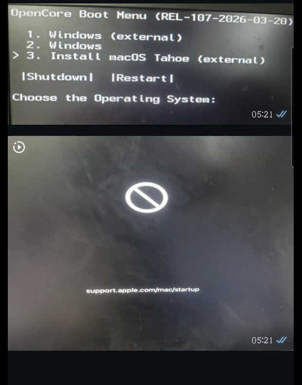

# Troubleshooting y Solución de Arranque - macOS Tahoe (15)

Este documento registra los problemas encontrados y las soluciones aplicadas durante el proceso de instalación de **macOS Tahoe** en un sistema basado en la arquitectura **Intel Haswell**. Es importante documentar esto de forma detallada, ya que macOS Tahoe probablemente sea una de las últimas versiones compatibles con procesadores x86.

## Hardware Objetivo
- **Procesador:** Intel Core i7-4790K (Haswell)
- **Placa Base:** Chipset B85
- **Tarjeta Gráfica:** AMD Radeon RX 550

## Problemas Encontrados y Proceso de Solución

Durante las pruebas iniciales para intentar arrancar el instalador de macOS Tahoe, nos enfrentamos a dos problemas críticos en nuestra plataforma Haswell:

1. **Equipo no arrancaba (Error Inicial):** El sistema simplemente se detenía durante el inicio, impidiendo llegar incluso al entorno de instalación básico.
   - *Solución:* Este error se resolvió luego de la correcta inyección y configuración del **SMBIOS**. Al establecer perfiles válidos y un modelo compatible de base, superamos la falla de arranque total.
   
   

2. **Mensaje de "Este Mac no es compatible":** A pesar de lograr llegar a la interfaz de recuperación/instalación, el instalador arrojaba una pantalla de error bloqueando el avance por motivos de falta de soporte nativo para nuestro hardware (SMBIOS de un modelo obsoleto para esta versión o arquitectura desactualizada).

## Soluciones y Cambios Implementados (Detalle Técnico)

Para superar los bloqueos anteriores y proceder con la instalación en el SSD, realizamos estas configuraciones clave en OpenCore:

### 1. Configuración del SMBIOS
- Se verificó y regeneró un registro de SMBIOS válido que brindará un buen perfil de energía ajustado para la configuración Haswell asegurando que OpenCore inyectara datos correctos, fundamentales para superar el fallo donde el sistema directamente no lograba bootear.

### 2. Evasión de Comprobaciones de Compatibilidad (Spoofing & Kexts)
Para eliminar el mensaje de "Este Mac no es compatible", aplicamos medidas para saltarnos las validaciones de la plataforma:
- **Argumento de Arranque (Boot-arg):** Se añadió el argumento `-no_compat_check` en nuestra sección `NVRAM -> Add -> 7C436110-AB2A-4BBB-A880-FE41995C9F82 -> boot-args` del `config.plist`.
- **RestrictEvents.kext:** Fue integrado este kext y configurado usando el argumento adicional `revpatch=sbvmm`. Esta combinación engaña al sistema para admitir la ejecución de las funciones del instalador, logrando esquivar el bloqueo total de compatibilidad.

### 3. Ajustes de la Configuración del Kernel (Quirks para B85)

### 4. Preparación del Almacenamiento
*A modo de recordatorio para la fase del instalador:* 
- Para que la unidad SSD interna aparezca correctamente en el instalador y se pueda proceder a su uso, se estableció que debe estar obligatoriamente formateada como **Mac OS Extended (Journaled)** o preferiblemente **APFS**, utilizando un mapa de particiones **GUID (GPT)**.

### 5. Inestabilidad y Falta de Aceleración Gráfica (Transparencias)
Un problema común al instalar macOS Tahoe/Sequoia con tarjetas AMD antiguas (Polaris/Baffin como la RX 550) es que el sistema arranca pero es extremadamente inestable y carece de aceleración Metal (sin transparencias). Esto se debe a dos errores frecuentes:

- **Error en OpenCore Legacy Patcher (OCLP):** Muchos usuarios buscan forzar el parche buscando la tarjeta en `Settings -> Advanced -> Graphics Override`. **Esta opción está diseñada ÚNICAMENTE para tarjetas MXM en iMacs antiguos**, no para Hackintosh. En un Hackintosh, OCLP detecta automáticamente el Spoof de la GPU si está bien configurado en el `config.plist`. Para aplicar el parche de AMD Polaris, simplemente se debe ir al menú principal de OCLP y hacer clic en **"Post-Install Root Patch"**.
- **Inestabilidad por AMFI (`amfi=0x80`):** Tener `amfi=0x80` en los `boot-args` desactiva completamente el sistema de integridad (Apple Mobile File Integrity). En macOS Tahoe/Sequoia, esto **rompe el sistema de permisos (TCC), causa crasheos constantes de aplicaciones y vuelve el WindowServer inestable**. 
  - *Solución:* Se debe **eliminar** `amfi=0x80` de los `boot-args`, y en su lugar, instalar el kext `AMFIPass.kext` (v1.4.1 o superior) añadiendo el argumento `-amfipassbeta` si se requiere, permitiendo así que OCLP funcione sin destruir la estabilidad del OS.

---
*Documentación generada para facilitar futuras instalaciones y mantenimientos del equipo en macOS Tahoe.*
