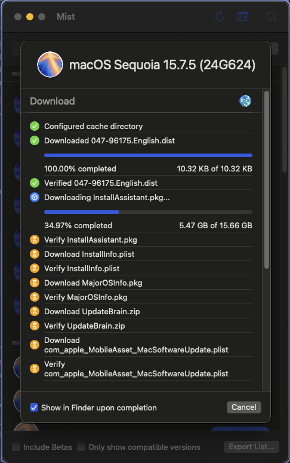
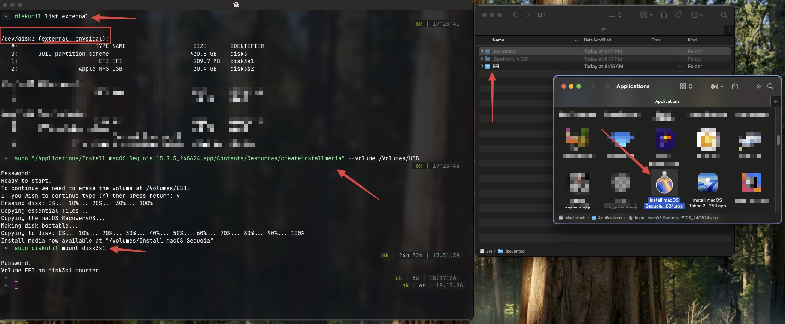

# 09. Solución a la Lentitud y Pantalla Blanca: Downgrade a macOS Monterey

## El Problema con Tahoe y Sequoia
Inicialmente, intentamos instalar y configurar **macOS Tahoe** y posteriormente **macOS Sequoia**. Aunque logramos arrancar y engañar (mediante *spoofing*) la dGPU RX 550 (Lexa) para que el sistema la reconociera como Baffin (RX 560), el rendimiento general del equipo resultó ser inaceptablemente lento (pantalla blanca, falta de Metal, lag crítico en la interfaz gráfica).

Tras una investigación profunda cruzando datos de foros especializados (Dortania, r/hackintosh, InsanelyMac), la conclusión fue contundente: **Es inviable correr Sequoia o versiones recientes suavemente con una RX 550 Lexa**. 

Las razones técnicas principales son:

1. **Eliminación de Drivers Polaris:** Apple ha eliminado progresivamente y finalmente por completo el soporte nativo para las tarjetas con arquitectura Polaris en las últimas versiones de macOS.
2. **RX 550 (Lexa) y la "Doble Trampa":** La variante Lexa nunca tuvo soporte oficial. Para hacerla funcionar, hay que engañar al sistema (Spoofing) para que crea que es una Baffin. En Sequoia, no solo tienes que hacer Spoofing, sino que además debes usar OpenCore Legacy Patcher (OCLP) para reinyectar los drivers Polaris eliminados.
3. **El Vicio de la Pantalla Blanca:** OCLP necesita aceleración gráfica (Metal) para renderizar su interfaz y permitirte aplicar los parches ("Root Patches"). Pero como tu gráfica Lexa está funcionando sin aceleración, OCLP se abre en blanco, impidiendo aplicar la solución.

El veredicto fue claro: *"Las Lexa son imposibles en Sequoia mediante OCLP. Hay que retroceder hasta donde Apple soportaba Polaris nativamente"*.

## La Solución Definitiva: Downgrade a macOS Monterey (12.x)
Para obtener un Hackintosh usable, veloz y estable con la **RX 550 Lexa**, la estrategia obligatoria es la siguiente:

1. **Instalar macOS Monterey (12):** Monterey es considerado el "Santo Grial" para gráficas AMD problemáticas porque es la última versión donde **Apple incluía los drivers de Polaris de forma nativa en el sistema**.
2. **Cero OCLP:** Al instalar Monterey, no necesitamos usar herramientas de terceros (OpenCore Legacy Patcher) para inyectar tarjetas de video.
3. **Spoofing Limpio:** Solo necesitamos que nuestra EFI haga el "Spoof" (engañar al sistema diciendo que la Lexa 699F es una Baffin 67FF). Una vez Monterey detecte el ID 67FF, cargará sus propios drivers nativos y la aceleración Metal funcionará al 100% de forma instantánea.

### Parches y Ajustes Definitivos en config.plist (EFI Híbrida)

Para lograr esto, fusionamos la estabilidad de red y ACPI de "Oralilla" con nuestros cálculos precisos de video:

#### 1. Identidad Correcta (SMBIOS)
Se utiliza el perfil **`MacPro7,1`**. Es el más compatible para el hardware antiguo tolerado en Monterey sin estrangular los recursos de red o energía de Haswell.

#### 2. Engaño de la dGPU (Lexa -> Baffin)
Se inyecta la propiedad directamente en el puerto PCI de la tarjeta de video para que macOS la confunda con el modelo superior soportado:
* Ruta: `PciRoot(0x0)/Pci(0x1,0x0)/Pci(0x0,0x0)`
* `device-id = FF670000` (67FF en reversa, emulando la RX 560 Baffin).
* `model = AMD Radeon RX 550 (Lexa spoofed to Baffin)`

#### 3. Soporte Ethernet
Integración de los kexts de red nativos (`RealtekRTL8111.kext` y `IntelMausi.kext`) provenientes de la base sólida de la EFI anterior.

## Sobre el Idioma del Instalador (Bug del NVRAM)
Si el instalador de macOS aparece bloqueado en un idioma incorrecto (ej. Español) y no deja elegir Inglés, se debe a que la memoria no volátil (NVRAM) de la placa base ha guardado la preferencia del intento anterior.

**¿Cómo solucionarlo?**
Se ha modificado el archivo `config.plist` (en la sección NVRAM) forzando el idioma Inglés:
`prev-lang:kbd` = `en-US:0`

> [!IMPORTANT]
> **Es obligatorio hacer un "Reset NVRAM" (Reiniciar NVRAM)** desde el menú principal de OpenCore (presionando la barra espaciadora si no está visible) la primera vez que se arranque con esta nueva EFI. Esto borrará la caché del viejo idioma y asegurará un despliegue limpio.

## Resumen y Advertencia Final
**No intentes actualizar a macOS Ventura, Sonoma, Sequoia o Tahoe con la RX 550 Lexa.** 

El camino oficial y estable, sin lidiar con pantallas blancas o parches rotos de OCLP, es **macOS Monterey**. Quédate en esta versión y el hardware volará con aceleración por hardware completa. Si alguna vez necesitas actualizar el sistema operativo, el equipo requerirá obligatoriamente el cambio físico de la tarjeta gráfica por una compatible de forma nativa (Ej: RX 580 o serie 6000).

## Anexo Histórico: Preparación fallida para Sequoia
A modo de registro de nuestro proceso iterativo, dejamos asentado que originalmente creamos un instalador buscando hacer funcionar macOS Sequoia, lo cual quedó documentado con las siguientes capturas. 

> [!NOTE]
> **Aclaración sobre estas imágenes:** Las capturas de Mist y de la terminal muestran referencias a "Sequoia". Se incluyen aquí solo como registro de nuestro intento previo fallido. Concluida la investigación, se demostró que ese instalador no era viable para la gráfica Lexa. El procedimiento técnico de montaje de disco y copia de la carpeta EFI documentado en la última captura se aplicó de **forma exactamente idéntica** al USB final de macOS Monterey.

> *(Arriba: Intento original descargando Sequoia, el cual fue finalmente descartado a favor de descargar Monterey)*

> *(Arriba: Demostración del montaje del pendrive y reemplazo de la carpeta EFI. Este método fue calcado para el pendrive definitivo de Monterey)*
